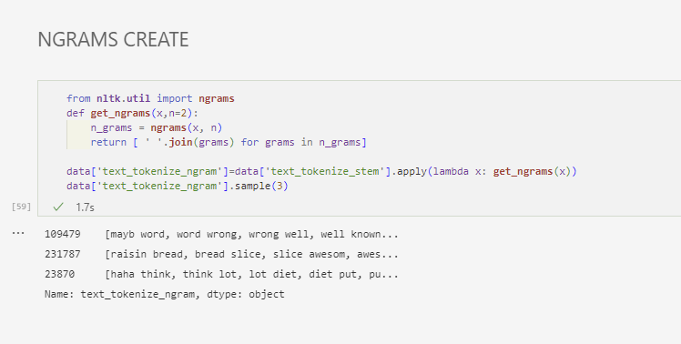

# Analyze Tweets Sentiment Using NLP

[](https://github.com/turkeruzun/twitter-data-analysis-nlp) [](https://linkedin.com/in/turkeruzun)

[](https://github.com/turkeruzun) [](https://github.com/turkeruzun)

[](http://turkeruzun.com.tr/kategori/veri-analizi/)

# SUMMARY

This study, analyze on Twitter data related to eating habits in April 2020. The data aims to reveal the effect of new information affected by Covid-19 on diet-related patterns among Twitter users during the pandemic. Sentiment analysis through frequently used words and on ngrams and explores the causal link between information-led society and attitude shifts during the pandemic in cyberspace.

## Installation Packages

Use the package manager [pip](https://pip.pypa.io/en/stable/) to install foobar.

``` bash
pip install nltk
pip install wordcloud
pip install sklearn
pip install pandas
pip install chardet
pip install textblob
pip install gensim
pip install scipy
pip install PIL
pip install pattern
...
```

## Load Packages

``` python
import pandas as pd
import numpy as np
import chardet
import re
import openpyxl
import string
import nltk
from nltk.corpus import stopwords
from nltk.stem import PorterStemmer,WordNetLemmatizer
from pattern.text.en import spelling
from pattern.text.en import suggest
from nltk.sentiment.vader import SentimentIntensityAnalyzer 
from textblob import TextBlob
import gensim
import pyLDAvis.gensim_models
import statistics as st
from scipy.stats import stats,mode
from wordcloud import WordCloud, STOPWORDS, ImageColorGenerator
from PIL import Image
import matplotlib.pyplot as plt
```

## Check Data


# STEMMING WORDS + NGRAMS

### 



# WORDCLOUD


# SENTIMENT ANALYZE


# LDA MODEL - FIND TOPICS


# HASHTAG SENTIMENT ANALYZE


# EMOJIES SENTIMENT ANALYZE


# Contributing

[](https://github.com/turkeruzun/twitter-data-analysis-nlp/issues) 

-   Clone [this](https://github.com/turkeruzun/twitter-data-analysis-nlp) repository:

``` bash
git clone https://github.com/turkeruzun/twitter-data-analysis-nlp.git
```

-   Check out any issue from [here](https://github.com/turkeruzun/twitter-data-analysis-nlp/issues).

-   Make changes and send [Pull Request](https://github.com/turkeruzun/twitter-data-analysis-nlp/pulls).

### Need help?

[](https://www.linkedin.com/in/turkeruzun/) [](https://turkeruzun.com.tr)

### License

© [turkeruzun](https://github.com/turkeruzun/twitter-data-analysis-nlp)

[](https://github.com/turkeruzun/twitter-data-analysis-nlp/network/members) [](https://github.com/turkeruzun/twitter-data-analysis-nlp/stargazers) [](https://github.com/turkeruzun/)
